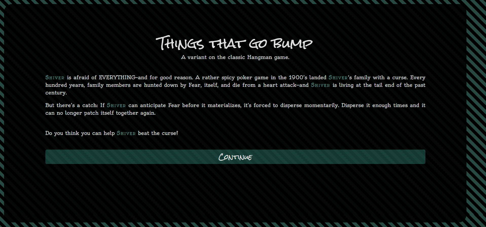
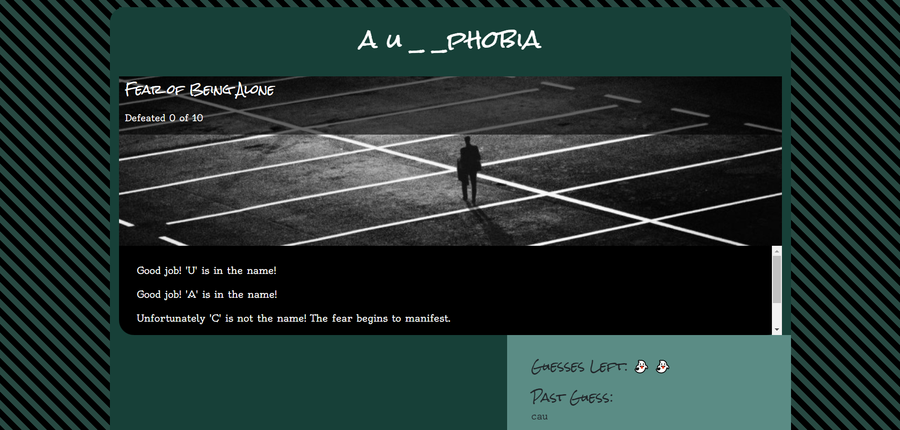
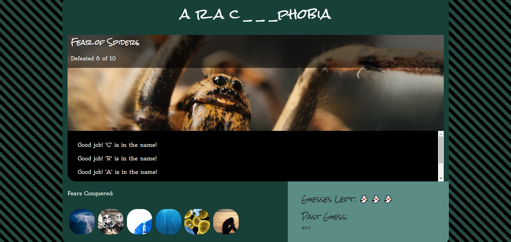

# Word Game: Things That Go Bump

**Link to live:** https://themarkfullton.github.io/Word-Guess-Game/

A spin on the classic Hangman game: You're defending a scardy cat (Shiver) from a family curse. Guess the proper name of the fear attacking Shiver and it disippates momentarily; guess it wrong and Shiver's down and out. If the fear disippates ten times, Shiver is free of the curse and can live a normal life! (That is, unless you want to play again!)

Went overboard on creating an example of what you can do with just vanilla JavaScript alone. Use to show students how innerHTML and DOM manipulation with vanilla JS works (as well as how to utilize arrays for data storage).

## Screenshots

